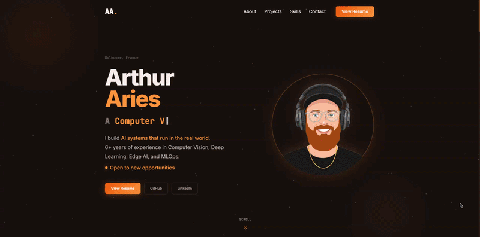

# Arthur Aries — Portfolio

[](https://arthuraries.com/)
[](https://react.dev/)
[](https://vitejs.dev/)
[](https://www.typescriptlang.org/)

Personal portfolio showcasing my work as a Computer Vision & Embedded AI Engineer. Built with **Vite + React + TypeScript**.

👉 **[View the live portfolio here](https://arthuraries.com)**

<br/>

<p align="center">
  
</p>


<br/>

- **Vite 8** — Blazing fast build tooling
- **React 19** — UI framework
- **TypeScript** — End-to-end type safety
- **Vanilla CSS (Custom Design System)** — Zero-dependency styling using CSS variables and modern layout techniques
- **React-PDF** — For the dedicated, in-app Resume viewer page
- **No external animation libraries** — All scroll-reveals and micro-animations use native IntersectionObserver and CSS keyframes for maximum performance.

## Getting Started

```bash
npm install
npm run dev
```

Open [http://localhost:5173](http://localhost:5173).

## Build

```bash
npm run build
# Output in dist/
```

## Project Structure

```
src/
├── components/
│   ├── Navbar.tsx         # Fixed navbar with scroll blur
│   ├── Hero.tsx           # Full-viewport hero with interactive 3D avatar & typewriter
│   ├── About.tsx          # Bio + quick facts sidebar
│   ├── Projects.tsx       # Dynamic 2-3-2 Flex grid (professional + personal)
│   ├── ProjectCard.tsx    # Individual project card with thumbnail/logo logic
│   ├── Skills.tsx         # Skill categories with colored pills
│   ├── Experience.tsx     # Vertical timeline
│   ├── Contact.tsx        # Contact links + 3D geometric SVG
│   ├── ResumePage.tsx     # Dedicated PDF viewer with EN/FR and Short/Long toggles
│   ├── Footer.tsx         # Minimal footer
│   └── ScrollReveal.tsx   # IntersectionObserver-based scroll reveal
├── data/
│   ├── projects.ts        # All project data (structured, typed)
│   └── skills.ts          # Skill categories
├── App.tsx                # Main layout and hash-based routing (#resume vs #home)
├── main.tsx               # React entry point
└── index.css              # Design tokens + global styles (Dark Mode)
public/
├── ARIES_Arthur_*.pdf     # CV and Resume assets (FR/EN, Short/Long)
└── images...              # Company logos and project thumbnails
```

## Deployment (GitHub Pages)

This project can be easily deployed to GitHub Pages or Vercel. 
To deploy manually to a GitHub Pages `gh-pages` branch, you can use the `gh-pages` npm package or set up a simple GitHub Actions workflow.

If deploying to a subdirectory (like `https://username.github.io/portfolio/`), remember to update `base: '/portfolio/'` in `vite.config.ts`.

## License

MIT
